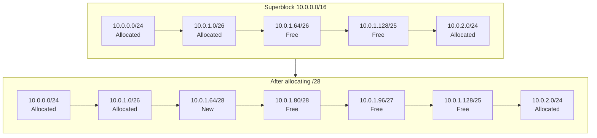

# atfutil

A simple IPAM (IP Address Management) tool written in Go that stores allocations and arbitrary metadata in YAML files. It allows you to allocate from the smallest fitting block to minimize IP space fragmentation and renders allocations to a markdown table for documentation.

## Key Concepts

- **Superblock**: A CIDR block that represents the total available IP address space
- **Block**: A CIDR block allocated from the superblock, assigned to a specific use or entity
- **ATF File**: YAML file storing the superblock definition and all allocated blocks

### Efficient IP Space Allocation

atfutil minimizes IP space fragmentation by always allocating from the smallest fitting free block. When you request a new subnet, the tool scans available gaps and selects the one that best matches your requested size, preventing wasteful holes in your address space.



The diagram above shows how a small /28 block fits precisely into the gap after a /26 allocation, rather than fragmenting a larger free area elsewhere.

## Installation

### From script (latest version)

```sh
curl -fsSL https://github.com/ylallemant/atfutil/raw/main/install.sh | bash
```

### Specific version

```sh
curl -fsSL https://github.com/ylallemant/atfutil/raw/main/install.sh | bash -s -- --version=x.y.z
```

### Build from source

```sh
go build -o atfutil ./cmd/atfutil/cmd.go
```

## Global Flags

| Flag | Short | Description |
|------|-------|-------------|
| `--file` | `-f` | Input file path for the ATF file |
| `--config` | `-c` | Config file (default is `$HOME/.atfutil.yaml`) |

## Commands

### touch

Check if an ATF file exists and create it if missing.

| Flag | Short | Required | Description |
|------|-------|----------|-------------|
| `--name` | `-n` | Yes | Name of the superblock |
| `--cidr` | | Yes | CIDR of the superblock |
| `--description` | `-d` | No | Description of the superblock |

**Example:**
```bash
# Create a new ATF file with a /16 superblock
atfutil touch -f network.atf.yaml -n "Production Network" --cidr 10.0.0.0/16
```

### allocate

Allocate a new block from the superblock. The smallest fitting free slice is automatically selected to minimize fragmentation.

| Flag | Short | Required | Description |
|------|-------|----------|-------------|
| `--id` | `-i` | Yes | ID for the allocated block |
| `--size` | `-s` | Yes | Size of the network to allocate (CIDR prefix length) |
| `--description` | `-d` | No | Description for the allocated block |
| `--output` | `-o` | No | Output file (defaults to input file) |

**Example:**
```bash
# Allocate a /24 subnet for the web tier
atfutil allocate -f network.atf.yaml -s 24 -i web-tier -d "Web application servers"

# Allocate a /28 subnet
atfutil allocate -f network.atf.yaml -s 28 -i database -d "Database servers"
```

### release

Release an allocated block and remove it from the file.

| Flag | Short | Required | Description |
|------|-------|----------|-------------|
| `--cidr` | `-c` | No* | CIDR of the block to release |
| `--id` | `-i` | No* | ID of the block to release |

*One of `--cidr` or `--id` is required.

**Example:**
```bash
# Release a block by ID
atfutil release -f network.atf.yaml -i web-tier

# Release a block by CIDR
atfutil release -f network.atf.yaml -c 10.0.1.0/24
```

### cidr

Show the CIDR of a specific block identified by ID. Can optionally allocate a block if it doesn't exist.

| Flag | Short | Required | Description |
|------|-------|----------|-------------|
| `--id` | `-i` | Yes | ID of the block to show CIDR for |
| `--allocate` | `-a` | No | Allocate the block if it doesn't exist |
| `--size` | `-s` | No* | Size of network to allocate (required with `--allocate`) |
| `--description` | `-d` | No | Description for newly allocated block |
| `--output` | `-o` | No | Output file (used with `--allocate`, defaults to input file) |

**Example:**
```bash
# Show CIDR for a specific block
atfutil cidr -f network.atf.yaml -i web-tier

# Get or create a block (useful in scripts)
atfutil cidr -f network.atf.yaml -i api-gateway -a -s 28 -d "API Gateway subnet"
```

### list

List all allocated blocks.

**Example:**
```bash
atfutil list -f network.atf.yaml
```

### validate

Validate the ATF file and ensure there are no overlapping blocks.

**Example:**
```bash
atfutil validate -f network.atf.yaml
```

### render

Render the sorted allocated blocks as a markdown table.

| Flag | Short | Description |
|------|-------|-------------|
| `--all-blocks` | `-a` | Include free (unallocated) blocks in output |
| `--render-format` | | Output format (default: markdown) |
| `--output` | `-o` | Output file (if not specified, outputs to terminal) |
| `--dry` | | Output to terminal instead of file |

**Example:**
```bash
# Render allocations to stdout
atfutil render -f network.atf.yaml

# Include free blocks in the output
atfutil render -f network.atf.yaml -a

# Save to a markdown file
atfutil render -f network.atf.yaml -o network.md
```

## ATF File Format

ATF files are YAML documents with the following structure:

```yaml
name: Production Network
description: Main production IP address space
superBlock: 10.0.0.0/16
allocations:
- ident: web-tier
  cidr: 10.0.1.0/24
  description: Web application servers
- ident: database
  cidr: 10.0.2.0/28
  description: Database servers
  subAlloc:
  - ident: primary
    cidr: 10.0.2.0/29
  - ident: replica
    cidr: 10.0.2.8/29
```

## Example Workflow

```bash
# 1. Create a new ATF file
atfutil touch -f infra.atf.yaml -n "Infrastructure" --cidr 10.99.0.0/16

# 2. Allocate subnets
atfutil allocate -f infra.atf.yaml -s 24 -i production -d "Production environment"
atfutil allocate -f infra.atf.yaml -s 24 -i staging -d "Staging environment"
atfutil allocate -f infra.atf.yaml -s 28 -i management -d "Management network"

# 3. Validate the configuration
atfutil validate -f infra.atf.yaml

# 4. Generate documentation
atfutil render -f infra.atf.yaml -a > infra.md

# 5. Query a specific allocation
atfutil cidr -f infra.atf.yaml -i production
```

## Examples

See the [example](example/) directory for sample ATF files and generated markdown output
